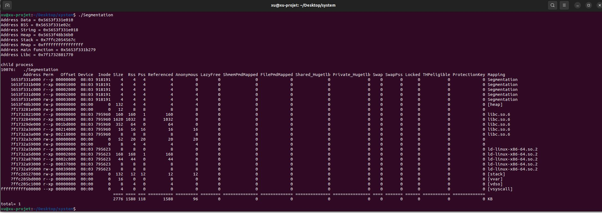

TP 1 – Segmentation mémoire et listes chaînées
==================================================
## Présentation
Comme ce TP n'est pas compte rendu.Donc, je présente le contenu de ce fichier dans ce dossier.

Selon le TP1, il existe trois fichiers en langage c correspondant aux trois parties du TP1.

On a mis en place toutes les fonctions. Aucune erreur ou warning.

avec des commentaires détaillés sur le code.
## Partie 1
**Segmentation.c**  =>   1 – Segmentation mémoire

En compilant avec le fichier **makefile**, on obtient le fichier **"Segmentation"**

Les résultats sont présentés dans le capture.

## Partie 2
**Projection.c** =>   2 – Projection de fichier en mémoire

En compilant avec le fichier **makefile**, on obtient le fichier **"Projection"**

Les résultats sont présentés dans le capture.

On a mis en place la lecture du fichier .txt et l'inversion de son contenu.

## Partie 3
**Liste.c** =>   3 – listes chaînées

En compilant avec le fichier **makefile**, on obtient le fichier **"Liste"**

Les résultats sont présentés dans le capture.

Les étapes 1-9 sont montrées dans l'image des résultats, les étapes 10-11 dans les commentaires du code.
