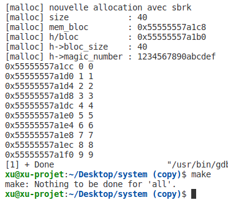
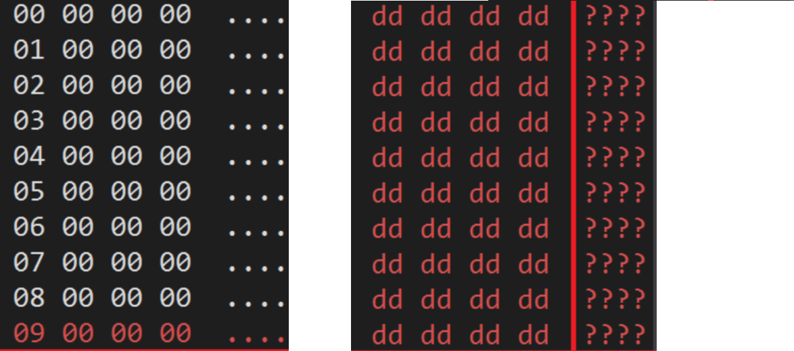

TP 2 – Allocateur de mémoire sécurisé
==================================================
Dans ce TP， on développera des fonctions qui se substitueront aux fonctions d’allocation/désallocation mémoire de la glibc. Dans un premier temps,On a crée les deux fonctions malloc_3is et free_3is.

Et puis, On teste notre allocateur de mémoire à l’aide d’un programme simple effectuant des allocations/libérations de mémoire via l’appel à malloc_3is et free_3is.

## Capture des résultats

## Comparer les informations d'adresse avant et après la libération de la mémoire

